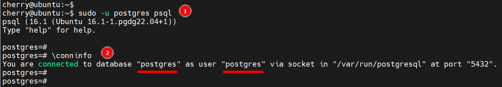
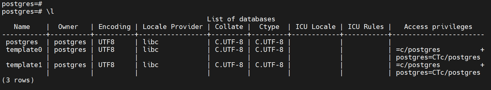

# Create PostgreSQL Database on Linux using Command Line

## Step 1: Login to PostgreSQL

```bash
sudo psql -U postgres
```

## Step 2: Create a new database

```bash
CREATE DATABASE new_database_name;

```

```bash
\conninfo
```



Verify the database

```bash
\l
```



Exit PostgreSQL

```bash
\q
```

[BACK](db-import-export.md)
